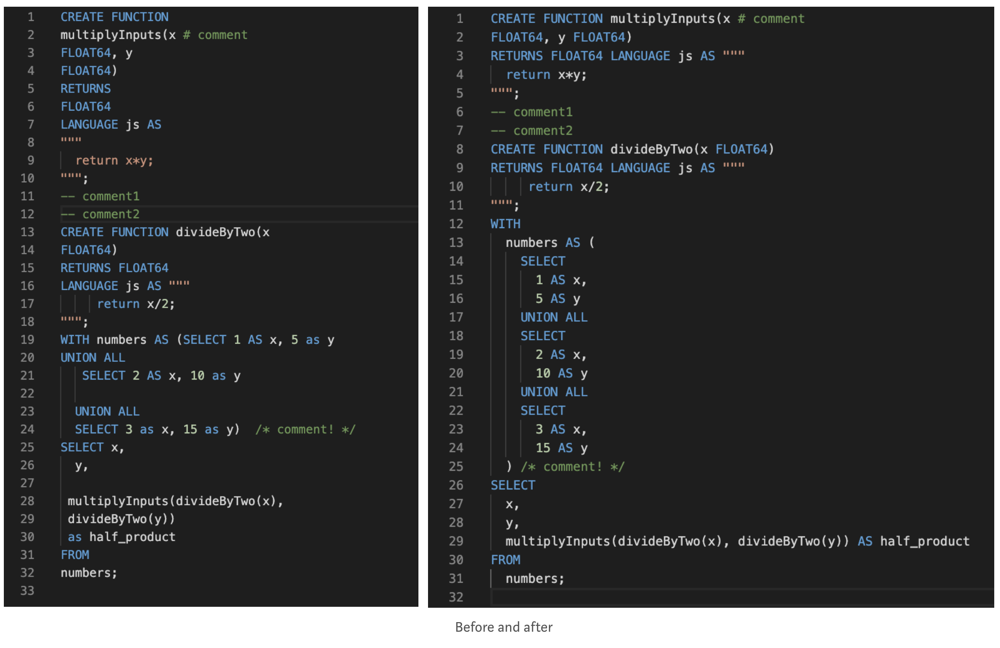

## ZetaSQL Formatter

[](https://github.com/Matts966/zetasql-formatter/actions?query=event%3Acreate+workflow%3Arelease+)
[](https://github.com/Matts966/zetasql-formatter/actions?query=branch%main+workflow%3Atest+)

<p align="center">
  
</p>

This repository is forked from [google/zetasql](https://github.com/google/zetasql) and provides SQL formatter with preserved comments. This formatter can be applied to mainly BigQuery and SpanSQL.

## Quick Start

```bash
# To install for MacOSX
wget https://github.com/Matts966/zetasql-formatter/releases/latest/download/zetasql-formatter_darwin_amd64.zip \
  && sudo unzip zetasql-formatter_darwin_amd64.zip -d /usr/local/bin
```

```bash
# To install for Linux
wget https://github.com/Matts966/zetasql-formatter/releases/latest/download/zetasql-formatter_linux_x86_64.zip \
  && sudo unzip zetasql-formatter_linux_x86_64.zip -d /usr/local/bin
```

```bash
# To apply formatter
zetasql-formatter [paths]
```

## License

[Apache License 2.0](LICENSE)

## Sponsors

The development of this formatter is sponsored by the Japan Data Science Consortium.
